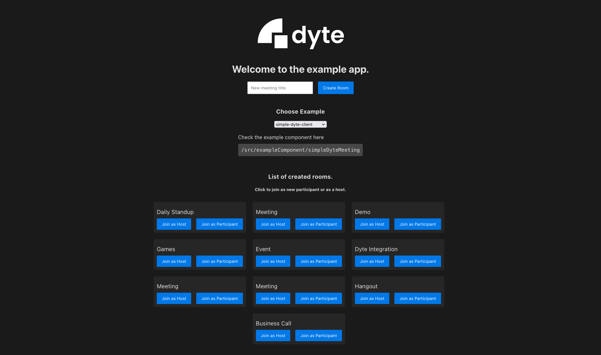

<!-- PROJECT LOGO -->
<p align="center">
  <a href="https://dyte.in">
    
  </a>

  <h3 align="center">Web Integration Example</h3>

  <p align="center">
    A simple express app which integrates with dyte using REST APIs.
    <br />
    <a href="https://docs.dyte.in"><strong>Explore the docs »</strong></a>
    <br />
    <br />
    <a href="https://dyte-react-demo.herokuapp.com">View Demo</a>
    ·
    <a href="https://github.com/dyte-in/web-integration-example/issues">Report Bug</a>
    ·
    <a href="https://github.com/dyte-in/web-integration-example/issues">Request Feature</a>
  </p>
</p>

<!-- TABLE OF CONTENTS -->

## Table of Contents

- [About the Project](#about-the-project)
  - [Built With](#built-with)
- [Structure](#structure)
- [Application FLow](#application-flow)
- [Getting Started](#getting-started)
  - [Installation](#installation)
- [Usage](#usage)

- [License](#license)

<!-- ABOUT THE PROJECT -->

## About The Project

A basic reactJS project demonstrating how you can integrate your react application with dyte.



Choose from a list of available meeting rooms, or create a new Dyte meeting and join as a participant or a host.

<!-- A demo is hosted on https://dyte-web-example.herokuapp.com/ -->

### Built With

- [create-react-app](https://github.com/facebook/create-react-app)
- [dyte-client](https://www.npmjs.com/package/dyte-client)
- [Axios](https://github.com/axios/axios)
- [Express](https://expressjs.com/)

<!-- GETTING STARTED -->

## Structure

React application structure :

```
├── src
│   ├── exampleComponent // sample example components
│   ├── container // contains main screen page component.
│   ├── app.tsx // page routes are defined here
│   ├── index.tsx // application js entry point
├── server.js // express server for serving pages and handleing api requests.

```

## Getting Started

Please make sure you have an organization ID and API Key for your application. These can be obtained from the developer portal.

### Installation

1. Clone the repo

```sh
git clone https://github.com/dyte-in/react-integration-example.git
```

2. Install NPM packages

```sh
npm install
```

3. Create an `.env` file with your credentials. Use `.env.example` as a template.

```sh
cp .env.example .env
# make changes in the .env file
```

4. Run the application

```sh
npm run start:dev
```


## Application Flow

The application by default will run here `http://localhost:3000`. The express server will be used to serve the build pages and the api request.

On opening `http://localhost:3000` in your browser, the client will first make an api call to check list of available meeting rooms. If not, then you can create a meeting room by entering a title and then click on create room button. The newly created room can be seen under the meeting room list section.

You can select the example that you want to test from the select example section. You can also refer the example component code with the path provided.

Finally, you can test the example by joining any meeting room as a host or as a participant. On clicking the button, a new user will be created by making an api call and meeting room will be launched.

All mandatory credentials of a user (i.e. roomname, user authtoken etc.) that are required to launch the meetings are stored in session storage.


<!-- USAGE EXAMPLES -->

## Usage

Choose from a list of examples and then join on any meeting room to test it live.

You can also refer the example component code with the path provided.

<!-- You can use this example as a reference on how you can integrate your webapp with dyte. -->

_For documentation on APIs and client SDKs, please refer to our [official documentation](https://docs.dyte.in)._

<!-- LICENSE -->

## License

Distributed under the MIT License. See [`LICENSE`](./LICENSE) for more information.
